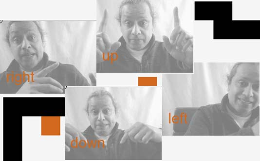

# P5 Gesture Control a Game Workshop

In this workshop, participants play a classic "snake" game and then train an AI to recognise some gestures.  These gestures can then be used to control the game.

Uses P5.js to control the game and Teachable Machine for the AI training.
